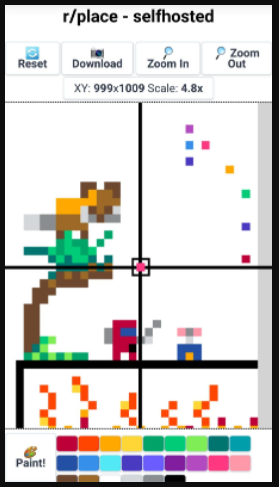

# r-place-selfhosted-ui

Run a self hosted version of [r/place](https://www.reddit.com/r/place). This is the UI project. For the Server version [Click Here](https://github.com/yonixw/r-place-selfhosted-server)



## CodeSandbox Demo

See how to get it running right away: https://youtu.be/5_Pc0r8Mipo

## How to Run

The front is a React project.

- Clone the repo
- Run `npm install`
- Run `npm start`

Also, To get a public url for the front, I suggest to simply import it to CodeSandbox and publish with Vercel.

You will also need the server up and running. The server need to be as secure as the UI (no HTTPS UI => HTTP WebSocket connections).

Pass the server address as a param in the URL (and add `/websockets` after), for example:

```
https://{ui-domain}/?server=wss://{server-domain}/websockets
```

## Features

The canvas size is 1024x1024. With support for 24 colors.

Programmed fetures:

- User send pixel
- Server brodcast pixel to other users
- Server periodiclly saves the image to disk
- Server send "compressed" image to new users on connect
- Server send "compressed" image to old users every few minutes (not enforces, ui side)

Missing features:

- Captcha validation against bots
- Username or Nickname association with each pixel:
  - Saving to disk
  - Sending for other Users who request it

## Data Consideration

If you intend to run the sever on a public cloud (AWS, Azure, Hetzner etc..) Please consider the following data being downloaded for each command:

- Send pixel (per user) => 3 Bytes
- Send full image (per user) => 0.7 MB (Compressed from 4MB)

So, for example, if you expect max 10 users concurrent for 3 days, with
each user getting full canvas every 5 min, you will have a minimum of:

```
10 * (60 / 5) * 24 * 3 = 8640 downloads
8640 * 0.7MB = 6GB of outbound data.
```

Currently Hetzner provide the cheapest option of a VM with 2cpu and 20TB outbound data for around 10 euro per month.

If you plan to run this from you home server, please notice you will have to send (with the same example as above) 504 MB of data every 5 minutes. Please assure your internet connection can support it.
